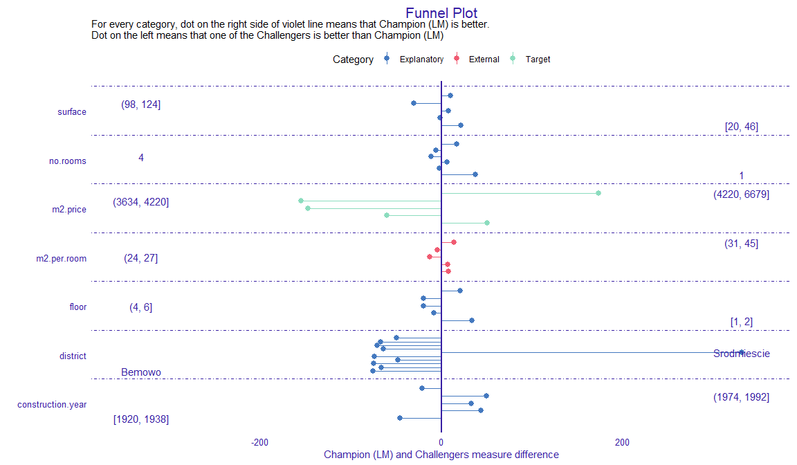
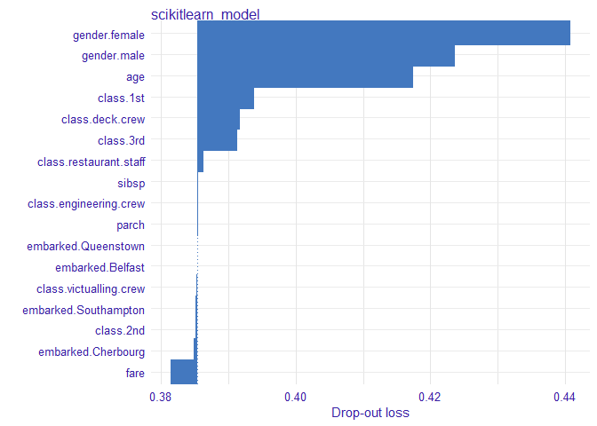

# DALEXtra 

[](https://travis-ci.org/ModelOriented/DALEXtra)
[](https://codecov.io/github/ModelOriented/DALEXtra?branch=master)
[](https://cran.r-project.org/package=DALEXtra)
[](http://cranlogs.r-pkg.org/badges/grand-total/DALEXtra)
[](http://drwhy.ai/#BackBone)

# Overview

The `DALEXtra` package is an extension pack for
[DALEX](https://modeloriented.github.io/DALEX) package. It contains
various tools for XAI (eXplainable Artificial Intelligence) that can
help us inspect and improve our model. Functionalities of the `DALEXtra`
could be divided into three areas.

  - Champion-Challenger analysis
      - Lets us compare two or more Machine-Learning models, determinate
        which one is better and improve both of them.
      - Funnel Plot of performance measures as an innovative approach to
        measure comparison.
      - Automatic HTML report.
  - Cross langauge comaprison
      - Creating explainers for models created in different languges so
        they can be explained using R tools like
        [DrWhy.AI](https://github.com/ModelOriented/DrWhy) family.
      - Currently supported are **Python** *scikit-learn* and *keras*,
        **Java** *h2o* and *mljar*, **R** *mlr* and *mlr3*.
  - Aspect Importance analysis
      - Provides instance-level explanations for the groups of
        explanatory variables.

## Installation

    # Install the development version from GitHub:
    
    # it is recommended to install latest version of DALEX from GitHub
    devtools::install_github("ModelOriented/DALEX")
    # install.packages("devtools")
    devtools::install_github("ModelOriented/DALEXtra")

or latest CRAN version

    install.packages("DALEX")
    install.packages("DALEXtra")

Other packages useful with explanations.

    devtools::install_github("ModelOriented/ingredients")
    devtools::install_github("ModelOriented/iBreakDown")
    devtools::install_github("ModelOriented/shapper")
    devtools::install_github("ModelOriented/auditor")

Above packages can be used along with `explain` object to create
explanations (ingredients, iBreakDown, shapper) or audit our model
(auditor).

# Champion-Challenger analysis

Without aby doubt, comaprison of models, espacially black-box ones is
very important use case nowadays. Every day new models are being created
and we need tools that can allow us to determinate which one is better.
For this purpose we present Champion-Challenger analysis. It is set of
functions that creates comaprisons of models and later can be gathered
up to created one report with generic comments. Example of report can be
found
[here](http://htmlpreview.github.io/?https://github.com/ModelOriented/DALEXtra/blob/master/inst/ChampionChallenger/DALEXtra_example_of_report.html).
As you can see any explenation that has generic `plot()` function can be
plotted.

## Funnel Plot

Core of our analysis is funnel plot. It lets us find subsets of data
where one of models is significantly better than other ones. That
ability is insanely usefull, when we have models that have similiar
overall performance and we want to know which one should we use.

``` r
 library("mlr")
 library("DALEXtra")
 task <- mlr::makeRegrTask(
   id = "R",
   data = apartments,
   target = "m2.price"
 )
 learner_lm <- mlr::makeLearner(
   "regr.lm"
 )
 model_lm <- mlr::train(learner_lm, task)
 explainer_lm <- explain_mlr(model_lm, apartmentsTest, apartmentsTest$m2.price, label = "LM", 
                             verbose = FALSE, precalculate = FALSE)

 learner_rf <- mlr::makeLearner(
   "regr.randomForest"
 )
 model_rf <- mlr::train(learner_rf, task)
 explainer_rf <- explain_mlr(model_rf, apartmentsTest, apartmentsTest$m2.price, label = "RF",
                             verbose = FALSE, precalculate = FALSE)

 plot_data <- funnel_measure(explainer_lm, explainer_rf, 
                             partition_data = cbind(apartmentsTest, 
                                                    "m2.per.room" = apartmentsTest$surface/apartmentsTest$no.rooms),
                             nbins = 5, measure_function = DALEX::loss_root_mean_square, show_info = FALSE)
```

``` r
plot(plot_data)[[1]]
```

<!-- --> Such
situation is shown in the following plot. Both, `LM` and `RF` models
have smiliar RMSE, but Funnel Plot shows that if we want to predict
expensive or cheap apartemnts, we definetly should use `LM` while `RF`
for average priced apartments. Also without any doubt `LM` is much
better than `RF` for `Srodmiescie` district. Following use case show us
how powerfull tool can Funnel Plot be, for example we can compund two or
models into one based of areas acquired from the Plot and thus improve
our models. One another advantage of Funnel Plot is that it doesn’t
require model to be fitted with Variables shown on the plot, as you can
see, `m2.per.room` is an artificial variable.

# Cross langauge comaprison

Here we will present short use case for our package and its
compatibility with Python.

## How to setup Anaconda

In order to be able to use some features associated with `DALEXtra`,
Anaconda in needed. The easiest way to get it, is visiting [Anaconda
website](https://www.anaconda.com/distribution). And choosing proper OS
as it stands in the following picture.

There is no big difference bewtween Python versions when downloading
Anaconda. You can always create virtual environment with any version of
Python no matter which version was downloaded first.

### Windows

Crucial thing is adding conda to PATH environment variable when using
Windows. You can do it during installation, by marking this
checkbox.


or, if conda is already installed, by following [those
instructions](https://stackoverflow.com/a/44597801/9717584).

### Unix

While using unix-like OS, adding conda to PATH is not required.

### Loading data

First we need provide the data, explainer is useless without them. Thing
is Python object does not store training data so always have to provide
dataset. Feel free to use those attached to `DALEX` package or those
stored in `DALEXtra`
files.

``` r
titanic_test <- read.csv(system.file("extdata", "titanic_test.csv", package = "DALEXtra"))
```

Keep in mind that dataframe includes target variable (18th column) and
scikit-learn models cannot work with it.

### Creating explainer

Creating exlainer from scikit-learn Python model is very simple thanks
to `DALEXtra`. The only thing you need to provide is path to pickle and,
if necessary, something that lets recognize Python environment. It may
be a .yml file with packages specification, name of existing conda
environment or path to Python virtual environment. Execution of
`scikitlearn_explain` only with .pkl file and data will cause usage of
default Python.

``` r
library(DALEXtra)
explainer <- explain_scikitlearn(system.file("extdata", "scikitlearn.pkl", package = "DALEXtra"),
yml = system.file("extdata", "testing_environment.yml", package = "DALEXtra"), 
data = titanic_test[,1:17], y = titanic_test$survived, colorize = FALSE)
```

    ## Preparation of a new explainer is initiated
    ##   -> model label       :  scikitlearn_model  (  default  )
    ##   -> data              :  524  rows  17  cols 
    ##   -> target variable   :  524  values 
    ##   -> predict function  :  yhat.scikitlearn_model  will be used (  default  )
    ##   -> predicted values  :  numerical, min =  0.02086126 , mean =  0.288584 , max =  0.9119996  
    ##   -> residual function :  difference between y and yhat (  default  )
    ##   -> residuals         :  numerical, min =  -0.8669431 , mean =  0.02248468 , max =  0.9791387  
    ##   -> model_info        :  package reticulate , ver. 1.13 , task classification (  default  ) 
    ##   A new explainer has been created!

Now with explainer ready we can use any of
[DrWhy.Ai](https://github.com/ModelOriented/DrWhy/blob/master/README.md)
universe tools to make explanations. Here is a small demo.

### Creating explanations

``` r
library(DALEX)
plot(model_performance(explainer))
```

<!-- -->

``` r
library(ingredients)
plot(feature_importance(explainer))
```

<!-- -->

``` r
describe(feature_importance(explainer))
```

    ## The number of important variables for scikitlearn_model's prediction is 3 out of 17. 
    ##  Variables gender.female, gender.male, age have the highest importantance.

``` r
library(iBreakDown)
plot(break_down(explainer, titanic_test[2, 1:17]))
```

<!-- -->

``` r
describe(break_down(explainer, titanic_test[2, 1:17]))
```

    ## Scikitlearn_model predicts, that the prediction for the selected instance is 0.132 which is lower than the average model prediction.
    ##  
    ## The most important variables that decrease the prediction are class.3rd, gender.female. 
    ## The most important variable that increase the prediction is age.
    ##  
    ## Other variables are with less importance. The contribution of all other variables is -0.108 .

``` r
library(auditor)
eval <- model_evaluation(explainer)
plot_roc(eval)
```

<!-- -->

``` r
# Predictions with newdata
predict(explainer, titanic_test[1:10, 1:17])
```

    ##  [1] 0.3565896 0.1321947 0.7638813 0.1037486 0.1265221 0.2949228 0.1421281
    ##  [8] 0.1421281 0.4154695 0.1321947

# Aspect importance

Aspect importance function provides instance-level explanations for the
groups of explanatory variables. It enables grouping predictors into
entities called aspects. Afterwards, it can calculate the contribution
of those aspects to the prediction.

To illustrate how the function works, we use titanic example. We build
random forest model, group features into aspects and choose new
observation to be explained. Then we build `DALEX` explainer and use it
to call aspect importance function. Finally, we print and plot function
results. We can observe that `personal` (`age` and `gender`) variables
have the biggest contribution to the prediction. This contribution is of
a positive type.

``` r
library("DALEX")
library("randomForest")
library("DALEXtra")
titanic <- titanic_imputed
titanic$country <- NULL
titanic_without_target <- titanic[,colnames(titanic)!="survived"]
aspects_titanic <-
  list(
    wealth = c("class", "fare"),
    family = c("sibsp", "parch"),
    personal = c("age", "gender"),
    embarked = "embarked"
  )
passenger <- titanic_without_target[4,]
model_titanic_rf <- randomForest(factor(survived) == "yes" ~ gender + age + 
                                   class + embarked + fare + sibsp + parch,  
                                 data = titanic)
predict(model_titanic_rf, passenger)
```

``` r
explain_titanic_rf <- explain(model_titanic_rf, 
                               data = titanic_without_target,
                               y = titanic$survived == "yes", 
                               predict_function = predict,
                               verbose = FALSE)
titanic_rf_ai <- aspect_importance(x = explain_titanic_rf, 
                                   new_observation = passenger, 
                                   aspects = aspects_titanic)
titanic_rf_ai
plot(titanic_rf_ai, add_importance = TRUE)
```

## Automated grouping

In examples described above, we had to manually group features into
aspects. Aspect importance provides `group_variables()` - function that
automatically groups features for us, based on the features correlation.
Function only works on numeric variables.

Below, we test aspect importance function on another dataset. But this
time we build aspect list by running run `group_variables()` (with cut
off level set on 0.6). As a result, we get a list of variables groups
(aspects) where absolute value of features’ pairwise correlation is at
least at 0.6.

``` r
library(DALEX)
data("apartments")
apartments_num <- apartments[,unlist(lapply(apartments, is.numeric))] 
apartments_no_target <- apartments_num[,-1]
new_observation_apartments <- apartments_num[10,]
model_apartments <- lm(m2.price ~ ., data = apartments_num)
aspects_apartments <- group_variables(apartments_no_target, 0.6)
predict(model_apartments, new_observation_apartments)
```

``` r
explain_apartments <- explain(model_apartments, 
                               data = apartments_no_target,
                               y = apartments$m2.price, 
                               predict_function = predict,
                               verbose = FALSE)
apartments_ai <- aspect_importance(x = explain_apartments, 
                                   new_observation = new_observation_apartments, 
                                   aspects = aspects_apartments, 
                                   N = 1000, show_cor = TRUE)
apartments_ai
plot(apartments_ai, aspects_on_axis = FALSE, add_importance = TRUE, 
     digits_to_round = 0)
```

# Acknowledgments

Work on this package was financially supported by the ‘NCN Opus grant
2016/21/B/ST6/02176’.
